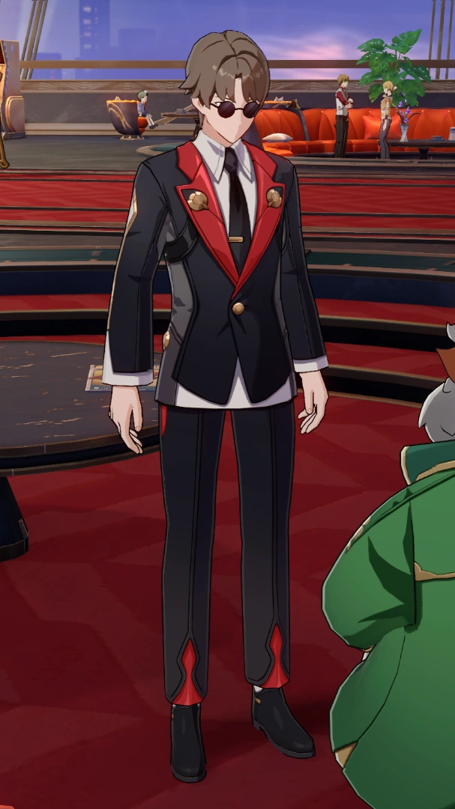
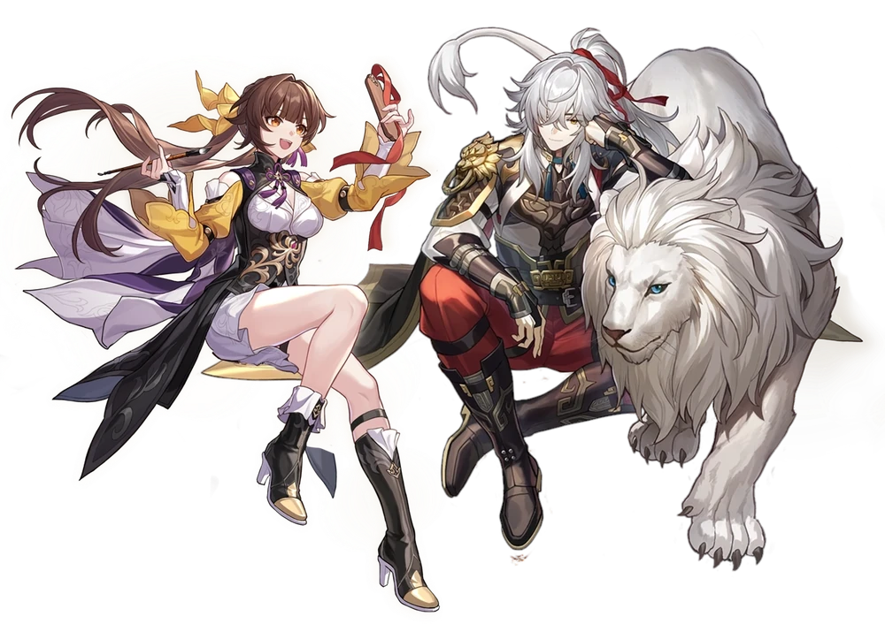
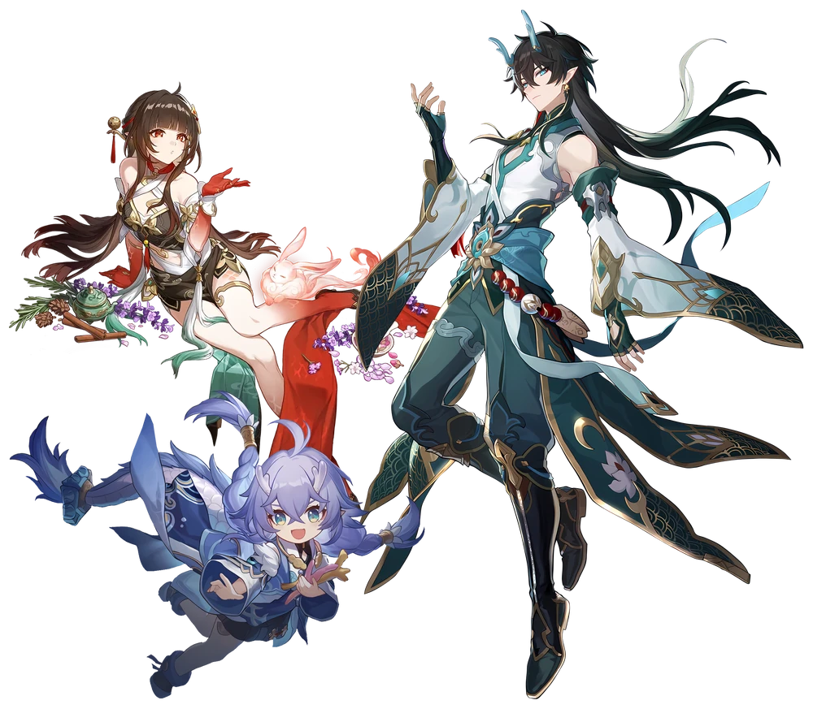
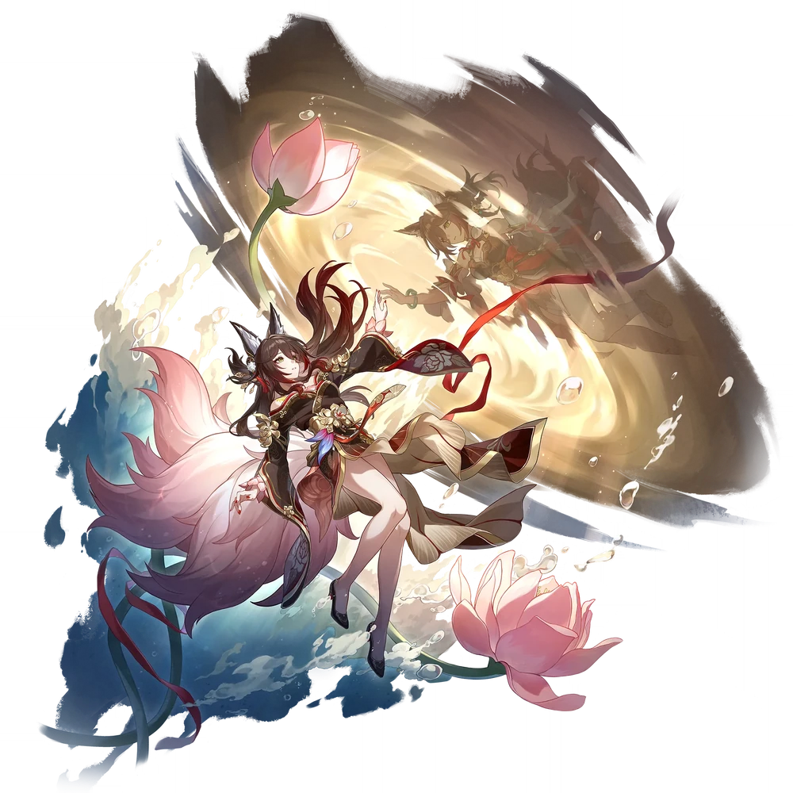
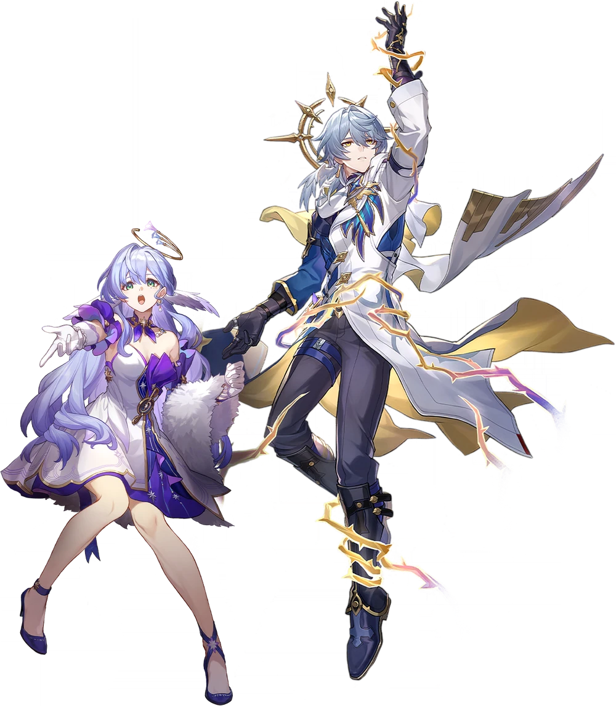
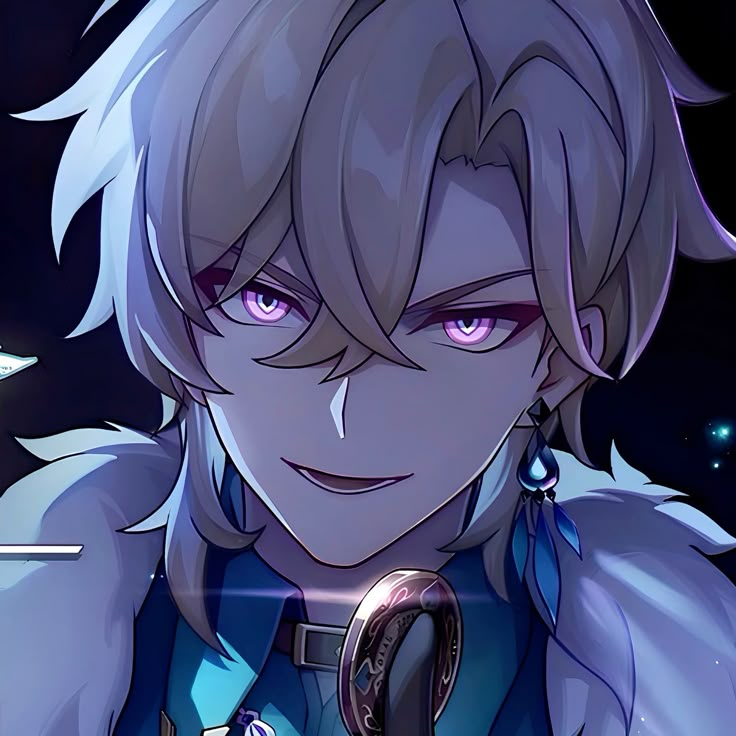
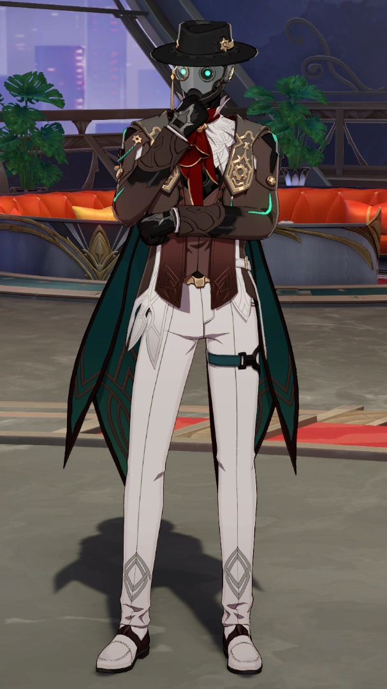

# Capítulo 05 — Raças

São **7 Raças** jogáveis, e todas elas aparecem aqui na mesma ordem de leitura: **citação**, **características**, **bônus de atributo** e **traços**, com a regra de cada traço fechada no lugar onde você vai consultá-la.

Nenhuma Raça é escolha ruim, e nenhuma é obrigatória para um conceito: **todo Atributo do jogo é oferecido por duas Raças diferentes**, além do bônus livre do Humano. O que distingue uma Raça da outra não é o tamanho do bônus — é para onde ele tende e **o que os traços dela fazem**.

> **As três coisas que toda Raça tem, sem exceção:**
>
> 1. **Um bônus de atributo** — **+2 em um** dos dois Atributos dela, **ou +1 em cada**. O Humano é o único que escolhe entre os seis.
> 2. **Um traço ativável** — você **declara em voz alta**, ele tem um relógio próprio, e é nessas poucas vezes por sessão que a sua Raça decide uma cena.
> 3. **Um traço passivo** — vale sempre, sem gastar nada e sem precisar lembrar.
>
> A moeda de cada Raça é diferente **de propósito**. Duas Raças pagas na mesma moeda viram, cedo ou tarde, uma versão menor da outra.

> **Lembretes da criação (capítulo 03):** o bônus racial entra **depois** da distribuição de atributos; nenhum Atributo passa de **15 na criação, antes dos bônus de Raça**, nem de **20 depois**.

---

## Humano

> *"A raça mais comum entre as estrelas."*

Humanos são uma das espécies mais numerosas da galáxia. Adaptáveis e ambiciosos, eles podem ser encontrados em praticamente todos os planetas e organizações, da Aliança Xianzhou à Corporação da Paz Interastral.

**Características**

- Grande capacidade de adaptação: qualquer cultura, planeta ou ofício.
- Vidas curtas, e pressa para preencher elas.
- Conhecidos pela criatividade e pela determinação.

**Bônus de atributo:** **+2 em um Atributo à sua escolha**, ou **+1 em dois Atributos diferentes**.

### Traço ativável — Força de Vontade

Você tem um recurso que ninguém mais no jogo tem: o **Esforço**.

> **Esforço:** gaste 1 ponto de Esforço para **rolar de novo qualquer dado** que você acabou de rolar, e use o resultado novo. Você pode declarar depois de ver o resultado, mas antes de o Mestre narrar a consequência.

- Você carrega **no máximo 1 ponto** de Esforço. Ganhar um segundo sem ter gasto o primeiro **perde** o excedente.
- Você recupera o ponto de duas formas: em um **Descanso Longo** (capítulo 23), ou **agindo de acordo com o que o seu personagem acredita**, uma vez por sessão, com a aprovação do Mestre.
- O que você acredita precisa ser **concreto**. "Eu acredito na verdade" não serve. "Eu não deixo ninguém para trás, nem inimigo" serve, e cobra um preço na cena — que é justamente o ponto.

> **O Esforço é exclusivo do Humano.** Nenhuma outra Raça, Caminho, Bênção, Habilidade, Cone de Luz, Relíquia ou item concede Esforço, e uma mesa sem nenhum Humano simplesmente não tem esse recurso à disposição. Não é esquecimento: é a identidade da Raça. Toda outra Raça tem um traço ativável, mas o dela serve a um propósito só; **o Esforço serve a qualquer rolagem do livro**.

### Traço passivo — Vocação Livre

Humano aprende o ofício do lugar onde está.

> Na criação, você escolhe **1 Perícia a mais** do que o seu Bônus de Sincronia entregaria (capítulo 04).

- A Perícia extra é escolhida como as outras, **na criação**, e é **permanente**.
- Ela **não** vem com Eficácia e **não** mexe nos slots de Eficácia do capítulo 26.
- Pode ser qualquer Perícia da lista do capítulo 04 que você **ainda não tenha** — inclusive uma que o seu Caminho não dê.

---

## Xianzhouíta

> *"Aqueles que desafiaram o ciclo da vida."*

Descendentes dos antigos habitantes de Xianzhou, esses seres receberam a bênção da longevidade após o contato com o Aeon da Abundância. Têm vidas extremamente longas, mas carregam o peso de séculos de memórias.

**Características**

- Corpo resistente e envelhecimento extremamente lento.
- Grande conhecimento acumulado.
- Cultura baseada em disciplina e tradição.

**Bônus de atributo:** **+2 em Vigor ou Sincronia**, ou **+1 em cada**.

### Traço ativável — Séculos de Memória

Você já viu este universo repetir-se. **Uma vez por cena**, de graça e sem rolar dado, aponte uma **criatura, um lugar ou uma tecnologia** e declare que já viveu algo parecido.

> Faça ao Mestre **uma pergunta concreta** sobre o que você apontou, dentro destas quatro: **o que é**, **de onde veio**, **do que tem medo** ou **o que ele quer**. O Mestre responde com **uma informação verdadeira**.

- A resposta é verdadeira, mas pode ser **incompleta** — você lembra de um século atrás, não da ficha do bicho. O Mestre nunca precisa revelar PV, Defesa, Fraqueza nem número nenhum: isso é assunto do capítulo 20, e **a Fraqueza continua sendo do Intellitron**.
- **Só funciona sobre o que tem passado.** Contra o que é genuinamente novo no universo — uma criatura inédita, uma máquina recém-construída, um lugar que acabou de existir — o Mestre diz "disso você não lembra", e **o uso não é gasto**.
- Fora de combate, a mesma pergunta cabe sobre um povo, uma instituição ou um acontecimento histórico.

Este é o traço que a Característica **"grande conhecimento acumulado"** sempre prometeu. Ele não dá bônus numérico, não gasta ação e não entra em teto nenhum (capítulo 26): ele entrega **informação**, que é a moeda que séculos de vida deveriam pagar.

### Traço passivo — Ad Vitam Aeternam

- **Você não pode ser Executado por ninguém.** A Execução (capítulo 23) simplesmente não funciona em você: um inimigo racional a Distância Pessoal que gaste o Ataque Básico dele para isso **perde a ação**.
- **Você tem Vantagem em qualquer Teste de Resistência.**

Vantagem permanente nos seis Testes de Resistência é o traço passivo mais forte da lista, e está certo que seja: é a Raça da longevidade. O preço está no traço ativável dela — o único do capítulo que **não resolve nada em combate**.

> **A Execução não é a mesma coisa que morrer.** Você continua caindo em **Morrendo** a 0 PV e continua rolando o Teste de Força de Vontade do capítulo 23 — com Vantagem, pelo traço acima. O que você não pode é ser **finalizado** por alguém enquanto está no chão.

---

## Vidyadhara

> *"Dragões que renascem através dos ciclos."*

Uma antiga raça de dragões humanoides de Xianzhou. Quando morrem, renascem em um corpo novo — mas as memórias não atravessam inteiras.

**Características**

- Forte conexão com a água e com a energia espiritual.
- Capacidade de regeneração e de renascimento.
- Grande afinidade com poderes ancestrais.

**Bônus de atributo:** **+2 em Vigor ou Poder**, ou **+1 em cada**.

### Traço ativável — Maré que Volta

O seu corpo se refaz como maré que volta.

> **Uma vez por Descanso Curto**, gaste a sua **Ação Complementar** para recuperar **`nível + Bônus de Vigor`** PV.

- É **só em você**. Este traço não cura aliado, não concede PV temporários e não remove condição (capítulo 21) — curar os outros é assunto da Abundância e da Preservação (capítulos 10 e 15).
- O relógio é o de "1 vez por descanso" do capítulo 23: **o Descanso Curto recarrega**, e você tem até dois por dia.

A cura é exatamente **metade** do que um Descanso Curto devolve (`(2 × nível) + Bônus de Vigor`, em 23.6), e é o único efeito de regeneração do livro que não vem de Caminho: **3** PV no nível 1, **12** no nível 10, **22** no nível 20, com Vigor +2.

### Traço passivo — Corpo das Marés

- Você **respira debaixo d'água indefinidamente** e **não faz Teste de Resistência Física contra afogamento**.

**Reencarnação Ancestral.** Você **não morre em definitivo**. No lugar da morte, você reencarna em outro corpo e pode voltar à mesa **um dia depois** da sua morte em jogo.

- A aparência passa a ser a do corpo em que você reencarnou, e esse corpo **obrigatoriamente** é de um Vidyadhara.
- Depois da reencarnação, role **1d20**:
  - **16 a 20:** você lembra do seu nome, da sua Raça, do seu **Propósito de Vida** e de **2 coisas importantes do seu passado** — e de **nada** do dia da sua morte.
  - **1 a 15:** você lembra só do nome, da Raça e do Propósito de Vida.
- O corpo novo entra no **nível do grupo**, com o equipamento do tier da faixa (capítulo 26). Nível, Habilidades, Bênçãos e Ultimate continuam sendo os seus: o que se perde é memória, não ficha.

> **Converse com o Mestre antes de usar isso como plano.** Reencarnar é uma reviravolta narrativa, não uma segunda vida gratuita: você volta um dia depois, e um dia é tempo suficiente para a cena inteira terminar sem você.

> **O que mudou da v1.1:** o traço era **Vantagem em Testes de Resistência Física contra afogamento, frio e efeitos de água** — e só isso. Numa campanha de ópera espacial, **nenhum inimigo do capítulo 28 aplica afogamento**, então o traço dependia de o Mestre montar a cena de água; e quando montava, o Xianzhouíta tinha a mesma Vantagem **e todas as outras**. A ficção da Raça promete "capacidade de **regeneração**" em três linhas de Características, e o livro nunca entregou uma linha de cura. Agora entrega, com número fechado e relógio do próprio livro. O afogamento virou **imunidade** em vez de Vantagem, porque respirar debaixo d'água é a única coisa do capítulo que o Xianzhouíta não faz.

---

## Vulpes

> *"A beleza e a astúcia das raposas celestiais."*

Uma raça de aparência humana com características de raposa, como caudas e sentidos aguçados. São conhecidos pela inteligência, pelo comércio e pela habilidade social.

**Características**

- Grande agilidade e percepção.
- Vida longa, embora inferior à dos Xianzhouítas.
- Facilidade para diplomacia e para manipulação.

**Bônus de atributo:** **+2 em Agilidade ou Discernimento**, ou **+1 em cada**.

### Traço ativável — Favor Antigo

Comércio é a memória de quem ficou devendo.

> **Uma vez por Descanso Longo**, **fora de combate**, você declara que alguém naquele lugar lhe deve um favor antigo. O Mestre diz **quem é** e **o que a pessoa cobra em troca** — o favor existe, mas o preço é dele.

- O favor é uma **pessoa**, não um recurso: ela ajuda **uma vez**, do jeito que ela pode ajudar, e o Mestre decide o que isso significa na cena.
- **Não serve para pedir combate.** O favor não entra em cena para lutar ao seu lado.
- Em lugar onde ninguém poderia te conhecer — nave recém-pousada em mundo deserto, estação inimiga selada —, o Mestre diz que não há ninguém, e **o uso não é gasto**.
- O preço é dito na hora e **vale**. O Mestre não precisa da sua aprovação para cobrá-lo, e é por isso que o traço não é um cheque em branco.

### Traço passivo — Língua de Prata

Você tem **Vantagem em Testes baseados no Atributo Presença** — Persuasão, Intimidação, Enganação, Liderança e o Teste de Força de Vontade.

**Raposa Astuta.** É mais difícil te pegar de surpresa.

> Quando você **falha** no Teste de Percepção Mental da **Surpresa** (capítulo 19), faça imediatamente um **Teste de Percepção Mental contra DT 10** como segunda chance. Se passar, você **não** recebe a condição Surpreso — e **não pode mais ser surpreendido pelo resto da cena**.

A DT 10 é fixa em todas as faixas e é uma das **cinco DTs de subsistema** do livro (capítulo 02).

> **O que mudou da v0.1:** o "Teste de Atenção", que era exclusivo dos Vulpes e rolava `d20 + Discernimento` contra DT 8, virou um **Teste de Percepção Mental contra DT 10**. O sistema tem 6 Testes de Resistência oficiais e não precisa de um sétimo que só uma Raça usa. Na prática o traço ficou **mais** confiável, porque o Teste de Percepção Mental soma Eficiência e o Teste de Atenção não somava nada.

---

## Haloviano

> *"Seres conectados ao mundo dos sonhos."*

Uma raça rara, conhecida pelas asas luminosas semelhantes a halos. Tem ligação natural com emoções, sonhos e o mundo mental.

**Características**

- Grande sensibilidade emocional.
- Poderes ligados à mente e aos sonhos.
- Asas luminosas, que seguram a queda mas não levantam voo.

**Bônus de atributo:** **+2 em Discernimento ou Presença**, ou **+1 em cada**.

### Traço ativável — To na sua mente

**2 vezes por dia.** Gaste a sua **Ação Complementar**.

1. **Ativação.** Faça um **Teste de Sintonia contra DT 13**. Se falhar, **este uso é gasto** e nada acontece.
2. **Resistência do alvo.** Se você passar, o alvo faz um **Teste de Força de Vontade** contra a sua DT (`8 + Bônus do Atributo de Habilidade + Eficiência`).
3. **Na falha do alvo**, ele fica **Controlado** (capítulo 21) por **2 turnos** se for Comum, ou **1 turno** se for Elite ou Boss.

**Não funciona em Boss em cena de clímax** sem autorização do Mestre. Fora de combate, o Mestre define a duração pela cena — a referência é **meia hora**.

A DT 13 da ativação é fixa em todas as faixas e é uma das **cinco DTs de subsistema** do livro (capítulo 02).

> **O que mudou da v0.1:** o teste oposto de Persuasão contra Intuição foi aposentado em favor de um **Teste de Força de Vontade** do alvo contra a sua DT, que é o Teste oficial para "medo, intimidação, controle mental e possessão" (capítulo 22). E a ativação, que era um d20 puro com 11 ou mais, virou um **Teste de Sintonia DT 13** — a mesma chance, com a Perícia certa somando. Os **2 usos por dia** são da v0.1 e ficam.

### Traço passivo — Asas de Halo

As asas não levam o seu peso para cima, mas não deixam você cair.

- Você **não sofre dano de queda**, de nenhuma altura, e **não faz Teste de Reflexos** por cair (capítulo 22).
- Você desce **planando**: ao cair, ou ao pular de propósito, você chega ao chão **de pé**, no ponto que escolher dentro de **uma Distância** do lugar de onde saiu (capítulo 18).
- **Não é voo.** Você não ganha altura, não ignora terreno em combate, e isso **não** muda a sua Velocidade, a sua Ação de Movimento nem a sua casa na Fila (capítulo 19).

---

## Avginiano

> *"Um povo marcado pelo destino."*

Uma raça rara, conhecida principalmente pela conexão com comércio, sobrevivência e adaptação. Muitos sofreram perseguição e escravização e tiveram a própria cultura destruída.

**Características**

- Grande resistência psicológica.
- Instinto de sobrevivência elevado.
- Facilidade para negociação.

**Bônus de atributo:** **+2 em Agilidade ou Presença**, ou **+1 em cada**.

### Traço ativável — Não Foi a Primeira Vez

O seu povo aprendeu a sobreviver ao que não deu para evitar.

> **Uma vez por combate**, quando você **falha** em um Teste de Resistência, declare este traço: a **duração** do efeito sobre você cai **pela metade** (arredonda para baixo, **mínimo 1 turno**).

- Vale para **qualquer** um dos seis Testes de Resistência, não só os três mentais da Mente de Ferro.
- Corta **duração**, não dano. O dano da fonte acontece por inteiro; o que encurta é o tempo que a condição fica em você (capítulo 21).
- Contra efeito de **duração 1 turno**, o mínimo já é 1: o traço não faz nada, e **o uso não é gasto**. Guarde-o para o efeito longo.
- Fora de combate, o Mestre converte pela cena, como faz com toda duração narrativa.
- **Não é re-rolagem.** Você falhou, e continua tendo falhado — o **Esforço** é e segue sendo exclusivo do Humano.

Repare no eixo: a **Mente de Ferro** te ajuda a **passar** no teste; a **Não Foi a Primeira Vez** te ajuda quando você **falha**. Nenhum outro traço do livro trabalha nesse segundo eixo, e é por isso que ele é do Avginiano.

### Traço passivo — Mente de Ferro

Por tudo que você e o seu povo passaram, a sua cabeça virou um lugar difícil de invadir. Você tem **Vantagem** em três dos seis Testes de Resistência:

- **Resistência Mental**
- **Percepção Mental**
- **Força de Vontade**

São exatamente os três Testes mentais do capítulo 22 — medo, ilusão, manipulação cognitiva, intimidação e controle. Contra um Caminho da Inexistência ou da Harmonia hostil, isso é a diferença entre perder o turno e rir na cara dele.

---

## Intellitron

> *"Máquinas que alcançaram a consciência."*

Seres artificiais criados por tecnologia avançada, que desenvolveram inteligência própria. Muitos ainda discutem se são máquinas ou formas de vida. Os Intellitrons, em geral, acharam a discussão entediante.

**Características**

- Corpo mecânico ou sintético.
- Não sofrem com doenças naturais.
- Grande capacidade de processamento.

**Bônus de atributo:** **+2 em Sincronia ou Poder**, ou **+1 em cada**.

### Traço ativável — Sabedoria de Intellitron

- Quando você faz o teste para **descobrir uma Fraqueza** de inimigo (capítulo 20), você rola **com Vantagem** e, em um sucesso, descobre **duas** Fraquezas em vez de uma.
- Fora de combate, **uma vez por cena**, o mesmo tipo de teste — **Pesquisa, Ciência ou Sintonia** contra a DT da cena — arranca **uma informação concreta** sobre algo que você queira saber: **um nome**, **um lugar**, **uma data** ou **uma relação entre duas coisas**. O Mestre escolhe qual dos quatro responde.

> **O que mudou da v0.1:** o teste de "descobrir uma fraqueza do inimigo com Pesquisa DT 12" era exclusivo do Intellitron. Na v1.0 ele virou a **regra geral** de qualquer personagem (capítulo 20), e o Intellitron continua sendo melhor nisso que todo mundo: **Vantagem** e **duas** Fraquezas por sucesso. O traço não perdeu valor; ele virou um traço de especialista em vez de um traço de monopólio.

### Traço passivo — Chassi

Você não é feito de carne.

- Você tem **Vantagem em Testes de Tecnologia e de Mecânica**.
- Você é **imune a doença natural** e a **veneno de origem biológica**.
- **Toxina sintética, nanomáquina, radiação e gás de combate afetam você normalmente**, e você continua rolando Teste de Resistência Física contra eles como qualquer um.
- Você **não precisa comer nem beber**, mas continua precisando de **Descanso Curto e Descanso Longo** (capítulo 23): o seu corpo não tem fome, e sim manutenção.

Isto é a Característica **"corpo mecânico ou sintético"** e **"não sofrem com doenças naturais"** virando regra. A terceira linha existe para a segunda não ser lida como imunidade ampla a veneno — o Intellitron é imune ao que é **vivo**, não ao que é **químico**.

---

## Tabela de consulta rápida

| Raça | Bônus de atributo | Traços | Imagem |
|---|---|---|---|
| **Humano** | +2 em um, ou +1 em dois | **Força de Vontade** (ativável: Esforço, 1 ponto, re-rola um dado) · **Vocação Livre** (passivo: +1 Perícia na criação) | `image2.png` |
| **Xianzhouíta** | +2 Vigor **ou** Sincronia, ou +1 em cada | **Séculos de Memória** (ativável: 1 por cena, uma pergunta respondida com verdade) · **Ad Vitam Aeternam** (passivo: não pode ser Executado; Vantagem em todo Teste de Resistência) | `image5.png` |
| **Vidyadhara** | +2 Vigor **ou** Poder, ou +1 em cada | **Maré que Volta** (ativável: 1 por Descanso Curto, recupera `nível + Vigor` PV) · **Corpo das Marés** (passivo: respira debaixo d'água; Reencarnação Ancestral) | `image12.png` |
| **Vulpes** | +2 Agilidade **ou** Discernimento, ou +1 em cada | **Favor Antigo** (ativável: 1 por Descanso Longo, alguém lhe deve um favor) · **Língua de Prata** (passivo: Vantagem em Testes de Presença; Raposa Astuta) | `image14.png` |
| **Haloviano** | +2 Discernimento **ou** Presença, ou +1 em cada | **To na sua mente** (ativável: 2 vezes por dia, deixa o alvo Controlado) · **Asas de Halo** (passivo: não sofre dano de queda) | `image16.png` |
| **Avginiano** | +2 Agilidade **ou** Presença, ou +1 em cada | **Não Foi a Primeira Vez** (ativável: 1 por combate, metade da duração na falha) · **Mente de Ferro** (passivo: Vantagem em Resistência Mental, Percepção Mental e Força de Vontade) | `image7.png` |
| **Intellitron** | +2 Sincronia **ou** Poder, ou +1 em cada | **Sabedoria de Intellitron** (ativável: Fraqueza com Vantagem e duas por sucesso; 1 informação por cena) · **Chassi** (passivo: Vantagem em Tecnologia e Mecânica; imune a doença natural) | `image6.png` |

### A cobertura de Atributos

Nenhum Atributo fica atrás de uma porta só. Cada um é oferecido por **duas** Raças, e nenhum par se repete:

| Atributo | Raças que concedem |
|---|---|
| **Poder** | Vidyadhara · Intellitron |
| **Agilidade** | Vulpes · Avginiano |
| **Vigor** | Xianzhouíta · Vidyadhara |
| **Sincronia** | Xianzhouíta · Intellitron |
| **Discernimento** | Vulpes · Haloviano |
| **Presença** | Haloviano · Avginiano |

O **Humano** escolhe livremente, então ele aparece em todas as seis linhas — é a identidade dele, não uma exceção à tabela.

### O traço ativável de cada Raça

| Raça | O verbo dela | Moeda | Relógio |
|---|---|---|---|
| **Humano** | re-rola um dado | recurso de uso livre | Descanso Longo, ou agir pela crença |
| **Xianzhouíta** | lembra um fato verdadeiro | informação antiga | 1 por cena |
| **Vidyadhara** | refaz o próprio corpo | PV, só em si | 1 por Descanso Curto |
| **Vulpes** | cobra um favor antigo | ficção social | 1 por Descanso Longo |
| **Haloviano** | toma o turno do inimigo | condição do capítulo 21 | 2 por dia |
| **Avginiano** | encurta o que o pegou | duração, na falha | 1 por combate |
| **Intellitron** | descobre o que ninguém vê | informação tática | por teste · 1 por cena |

> **Sobre o Executado.** Na v0.1, a regra de Execução estava escrita **dentro** do traço dos Xianzhouítas — ou seja, a regra mais letal do jogo morava num benefício racial que seis das sete Raças nunca liam. Na v1.0 ela é uma regra geral do **capítulo 23**, e o traço Xianzhouíta é o que ele sempre foi: a exceção a ela.
