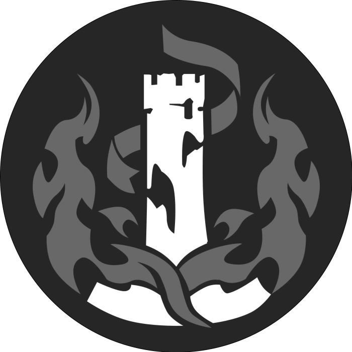
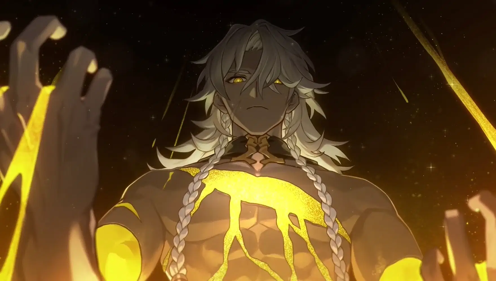

# Capítulo 07 — A Destruição

> **Aeon: Nanook**

Os seguidores do Caminho da Destruição acreditam que toda criação nasce do caos e que a ruína é uma força inevitável do universo. Guiados pelo desejo de superar limites, eles carregam dentro de si a chama da destruição e usam a própria força, a própria fúria e a própria determinação para enfrentar inimigos e desafiar destinos impostos. Quem segue esse Caminho não busca apenas destruir: busca abrir espaço para que algo novo surja das cinzas, e por isso se torna um guerreiro capaz de suportar grandes perdas e continuar avançando mesmo quando tudo parece perdido.

---

## 7.1 A ficha do Caminho

| | |
|---|---|
| **Aeon** | Nanook |
| **Eixo mecânico** | Dano bruto pago com os próprios PV |
| **Recurso próprio** | **Os seus PV**, gastos como moeda (7.2) |
| **Atributo de Habilidade** | **Poder** ou **Vigor** (escolha fixa na criação) |
| **Perícias com Eficiência** | **Atletismo**, **Sobrevivência**, **Resistência** |
| **Índice de vitalidade N** | **6** — o maior do jogo |
| **PV** | 61 no nível 1 · 178 no 10 · **308** no 20 (com Bônus de Vigor +2) |
| **Bônus de Velocidade** | **+1** |

**Como a Destruição joga.** Você é o Caminho mais resistente do livro e é o único que trata PV como **moeda**. Metade das suas Bênçãos cobra a sua própria vida para entregar dano, e três delas só ligam quando você já está ferido. Isso não é armadilha de design: é a identidade de Nanook, e é o que faz o grupo olhar para a sua barra de PV e decidir se a cura vai para você ou para outra pessoa.

> **Você precisa de alguém que cure.** Um grupo com Destruição e sem Abundância, sem Preservação e sem itens de cura joga a Destruição em metade da potência dela — porque metade das Bênçãos deste capítulo só vale a pena se alguém devolver o que você gastou.

---

## 7.2 O custo em PV, com número

A v0.1 construiu este Caminho inteiro sobre **porcentagem do PV máximo**: 5% por turno, até 25% de uma vez, uma Marca a cada 20% perdidos. A v1.0 **preserva a construção** — pagar com a própria vida — e troca a porcentagem por **múltiplo de nível**, que é a moeda do resto do livro:

| Onde aparece | Custo |
|---|---|
| Ativação ou acúmulo de Bênção de custo | **PV igual a 2 × seu nível** |
| Compra de **dado base** no Avatar | **PV igual a 5 × seu nível** |

Três regras fecham o assunto, e elas valem para todas as Bênçãos deste capítulo:

- **Você escolhe pagar.** Nenhum custo em PV deste capítulo é obrigatório, e nenhum deles pode te levar a 0 PV: se o custo for maior ou igual aos seus PV atuais, **você não pode pagar**.
- **PV gastos assim são dano?** Não. Eles **não** disparam efeitos de "quando você sofre dano", **não** geram Energia (capítulo 17) e **não** passam por RD. Você está gastando, não sofrendo.
- **PV gastos contam para as Marcas** de *Cicatriz da Destruição*, que é a Bênção feita para transformar esse gasto em acúmulo.

> **Por quê não ficou em porcentagem:** no nível 20 você tem 308 PV. "5% por turno" seriam 15 PV, e "25% de uma vez" seriam 77 — números que crescem sozinhos, fora de qualquer orçamento, e que fariam a mesma Bênção custar 3 PV no nível 1 e 77 no nível 20 sem nenhum degrau no meio. Com `2 × nível` e `5 × nível`, o preço é lido na hora, cresce em linha reta e continua doendo: no nível 20, **100 PV por um dado**.

---

## 7.3 As 12 Bênçãos da Destruição

Seis sem requisito, quatro a partir do nível 9, duas a partir do nível 17. Você adquire **10** delas, uma em cada nível ímpar.

### 1. Pacto da Ruína
**Tier I — sem requisito de nível**

> *"Você aprendeu que a sua própria vida é apenas combustível para a destruição."*

**Efeito**

- **Uma vez por turno**, depois de acertar um ataque, gaste **PV igual a 2 × seu nível** para causar **dano adicional igual à sua Eficiência**.
- Com **metade ou menos** dos seus PV, o dano adicional **dobra**: `2 × Eficiência`.

> **É sempre Eficiência, nunca Eficácia.** A Eficácia não entra em dano, como não entra em Teste de Ataque (capítulo 02). A v0.1 oferecia "Eficiência **ou** Eficácia", o que no nível 20 era a diferença entre +8 e +16 numa Bênção de Tier I.

### 2. Corpo Forjado na Dor
**Tier I — sem requisito de nível**

> *"Seu corpo se fortaleceu através de incontáveis ferimentos."*

**Efeito**

- Escolha **um Elemento** quando adquirir esta Bênção. Enquanto estiver com **metade ou menos** dos seus PV, você tem **Resistência** àquele Elemento (capítulo 20: **-2 dados**, mínimo 1 dado, mínimo 1 de dano).
- **Uma vez por combate**, quando um dano te reduziria a 0 PV, faça um **Teste de Resistência Física** contra a **DT Média da sua faixa de nível** (capítulo 27). Se passar, você fica com **1 PV**.

### 3. Quebrador de Mundos
**Tier I — sem requisito de nível**

> *"Você se especializou em destruir defesas inimigas."*

**Efeito**

- Alvo com **Resistência** ao seu Elemento **não reduz os seus dados**: você rola os dados cheios contra ele.
- Os seus ataques **ignoram 2 pontos de RD** do alvo.
- Ao acertar um alvo que tem **Fraqueza** ao seu Elemento, os seus ataques contra ele passam a **ignorar Eficiência pontos de Defesa** até o fim do próximo turno dele.

> **O que mudou da v0.1:** "causa dano normal contra Resistência ou algum tipo de Armadura" ganhou os dois números que faltavam (os dados cheios e os 2 pontos de RD), e o "-3 na Defesa dela" virou **ignorar Eficiência pontos de Defesa**, que é a conversão oficial do livro para esse tipo de efeito. A diferença prática: penalidade de Defesa valeria para todo mundo e entraria no teto de penalidade somada; ignorar Defesa vale só para você e não disputa teto com o resto do grupo.

### 4. Sacrifício Desesperado
**Tier I — sem requisito de nível**

> *"Você transforma ferimentos em poder."*

**Efeito**

- Gaste a sua **Ação Complementar** e **PV igual a 2 × seu nível** para ganhar **1 acúmulo de Fúria**. Máximo de **2 acúmulos por combate**.
- Cada acúmulo dá **+1d6** de dano do seu Elemento em todos os seus ataques, até o fim do combate.
- Os acúmulos **terminam** se você voltar a ter **mais da metade** dos seus PV.

Os dados de Fúria são dados adicionais de fonte temporária: eles disputam o **teto de dados adicionais** (+3 dados, capítulo 26) com Quebrado, Vulnerável e tudo o mais.

### 5. Instinto de Sobrevivência
**Tier I — sem requisito de nível**

> *"A proximidade da morte desperta o seu verdadeiro poder."*

**Efeito** — enquanto estiver com **um terço ou menos** dos seus PV:

- **+2** em Testes de Ataque (dentro do teto de bônus somado).
- A sua Ação de Movimento cobre **+1 Distância**.

### 6. Impacto Devastador
**Tier I — sem requisito de nível**

> *"Seus ataques não buscam ferir, mas destruir completamente."*

**Efeito**

- Quando você causa um **acerto crítico** ou **reduz um inimigo a 0 PV**, você ganha uma **Ação Extra**: um Ataque Básico, **ou** uma Habilidade de Nível 2 ou menor (pagando o PH), **ou** uma Ação de Movimento.
- Vale o teto do sistema: **1 Ação Extra por criatura por Ciclo**, somando todas as fontes (capítulo 18).

---

### 7. Cicatriz da Destruição
**Tier II — requisito: nível 9**

> *"Cada batalha deixa marcas que fortalecem você."*

**Efeito**

- Durante um combate, a cada **2 × seu nível** PV que você **perder ou gastar** (somando tudo: dano sofrido e custo de Bênção), você ganha **1 Marca da Ruína**. Máximo de **5 Marcas**, e elas zeram no fim do combate.
- Cada Marca dá **+1 de dano** nos seus ataques e **+1** em Testes de **Força de Vontade** e de **Resistência Mental**.

> Os dois bônus são numéricos e temporários: eles respeitam o **teto de bônus somado** da sua faixa (+3 até o nível 9, +4 de 10 a 15, +5 de 16 a 20). Na prática, esta Bênção **cresce com você** — no nível 9, três Marcas já encostam no teto; no nível 16, as cinco contam.

### 8. Aniquilador de Resistências
**Tier II — requisito: nível 9**

> *"Você sabe exatamente onde quebrar um inimigo."*

**Efeito**

- Quando você acerta o **mesmo inimigo duas vezes seguidas**, você pode forçá-lo a um **Teste de Resistência Física** contra a sua **DT** (`8 + Bônus do Atributo de Habilidade + Eficiência`).
- **Na falha:** os seus ataques contra ele **ignoram Eficiência pontos de Defesa** até o fim do próximo turno dele, e o **seu próximo ataque** que acertá-lo causa **o dobro da Redução de Tenacidade** (capítulo 20).
- **Se ele passar:** nada acontece. Esta Bênção não causa dano, e efeito sem dano não produz meio-efeito (capítulo 22).
- Contra **Elite e Boss**, o dobro de Redução de Tenacidade continua valendo, e a **Firmeza** deles continua valendo para o Atraso que a Quebra provoca (capítulo 19).

> **O que mudou da v0.1:** o nome do teste era *"Teste de Resistência de Resistência Física"*, redundante, e a DT era *"o resultado do seu Teste de Ataque menos 8"* — uma DT derivada de uma rolagem, coisa que não existe em nenhum outro lugar do livro. Agora é a sua **DT oficial**, a mesma de todas as suas Habilidades, que você já tem anotada na ficha.

### 9. Último Fragmento de Vida
**Tier II — requisito: nível 9**

> *"Sua força cresce quando tudo parece perdido."*

**Efeito** — **uma vez por Descanso Longo**:

- Quando você cai a **0 PV**, em vez de ir para **Morrendo** (capítulo 23), você fica **consciente e de pé por 1 turno**.
- Durante esse turno: os seus Testes de Ataque rolam com **Vantagem**, você causa **+1d6** de dano, e os seus ataques **ignoram Resistência** (rola os dados cheios).
- **No fim desse turno você cai em Morrendo**, com 0 PV, a menos que alguém tenha te curado antes.

### 10. Juramento de Cinzas
**Tier II — requisito: nível 9** · *Bênção nova da v1.0*

> *"Você promete a Nanook o que ainda sobrou de você."*

**Efeito**

- **Uma vez por Ciclo**, gaste a sua **Ação Complementar** e **PV igual a 2 × seu nível**.
- Até o fim do seu **próximo turno**: cada ataque seu que acertar reduz **+1 de Tenacidade** além do normal, e você ganha **+2 RD** (dentro do teto de RD do capítulo 18).

---

### 11. Avatar da Destruição
**Tier III — requisito: nível 17**

> *"Você se tornou uma manifestação viva do Caminho."*

**Efeito**

- **Compra de dados.** Gaste **PV igual a 5 × seu nível** para ganhar **+1 dado base** no dano de um ataque, Habilidade ou Ultimate. **No máximo +2 dados por Ciclo**, e sempre dentro do **teto de dados adicionais** (+3 dados, capítulo 26).
- **Com metade ou menos dos seus PV:** os seus ataques de alvo único também atingem **1 inimigo adicional** a até uma Distância do alvo, com **metade dos dados** (arredonda para baixo, mínimo 1 dado).
- **Com metade ou menos dos seus PV:** os **seus** ataques causam **o dobro da Redução de Tenacidade** contra inimigos a até Distância Curta, respeitando a **Firmeza** de Elite e Boss.
- **Uma vez por combate**, ao derrotar um inimigo, você recupera **5 × seu nível** PV.

> **O que mudou da v0.1, e por quê:** o texto original dizia *"sacrifique seus próprios PV, o quanto quiser, para aumentar o dado de dano; se o dano já for d20 você ganha +d20"*. Isso é **troca ilimitada de PV por dados**: no nível 20, um personagem com 308 PV compraria dados até cair, e com a cura do grupo em jogo a conta sempre fecharia a favor dele. Com **5 × nível por dado**, **teto de +2 dados por Ciclo** e o teto de dados adicionais por cima, a Bênção continua sendo o botão de pânico que o autor escreveu — com um preço que a mesa sente.
>
> A segunda mudança: o dobro de Redução de Tenacidade era *"por todas as fontes"*, ou seja, valeria para o grupo inteiro. Ficou nos **seus** ataques. O motivo é aritmético: dobrar a Tenacidade arrancada pela mesa inteira apagaria a cadência de Quebra publicada no capítulo 27 e faria o Boss de fim de campanha sofrer Quebra todo Ciclo.

### 12. Fim de Toda Muralha
**Tier III — requisito: nível 17** · *Bênção nova da v1.0*

> *"Nada do que foi erguido tinha intenção de ficar."*

**Efeito** — **uma vez por combate**, no lugar do seu **Ataque Básico**:

- Escolha até **3 inimigos** a até uma Distância um do outro, dentro do alcance da sua arma. Faça um **Teste de Ataque separado** contra cada um.
- Cada alvo acertado sofre o dano do seu Ataque Básico com **metade dos dados** (arredonda para baixo, mínimo 1 dado) e a **Redução de Tenacidade** normal de um Ataque Básico.
- Se você gastar **PV igual a 5 × seu nível** ao declarar, os dados **não** são reduzidos: cada alvo acertado sofre o dano cheio.

---

## Resumo do capítulo

| # | Bênção | Tier | Em uma linha |
|---|---|---|---|
| 1 | **Pacto da Ruína** | I | Gaste `2 × nível` PV por `+Eficiência` de dano; dobra abaixo da metade dos PV |
| 2 | **Corpo Forjado na Dor** | I | Resistência a um Elemento abaixo da metade dos PV; 1 vez por combate, fica com 1 PV |
| 3 | **Quebrador de Mundos** | I | Dados cheios contra Resistência, ignora 2 de RD, ignora Defesa contra quem tem Fraqueza |
| 4 | **Sacrifício Desesperado** | I | Até 2 acúmulos de `+1d6`, pagos com `2 × nível` PV cada |
| 5 | **Instinto de Sobrevivência** | I | Com um terço dos PV ou menos: +2 em ataques e +1 Distância |
| 6 | **Impacto Devastador** | I | Crítico ou abate concede **Ação Extra** (teto de 1 por Ciclo) |
| 7 | **Cicatriz da Destruição** | II (9+) | Marcas da Ruína: +1 de dano e +1 em dois Testes, até 5, dentro do teto |
| 8 | **Aniquilador de Resistências** | II (9+) | Dois acertos seguidos forçam Teste de Resistência Física; dobra a Redução de Tenacidade |
| 9 | **Último Fragmento de Vida** | II (9+) | A 0 PV, 1 turno de pé com Vantagem, +1d6 e ignorando Resistência |
| 10 | **Juramento de Cinzas** | II (9+) | `2 × nível` PV por +1 de Tenacidade por acerto e +2 RD |
| 11 | **Avatar da Destruição** | III (17+) | `5 × nível` PV por dado (máx. +2 por Ciclo), área ferido, dobro de Tenacidade |
| 12 | **Fim de Toda Muralha** | III (17+) | 1 vez por combate: Ataque Básico em 3 alvos, dados cheios por `5 × nível` PV |
