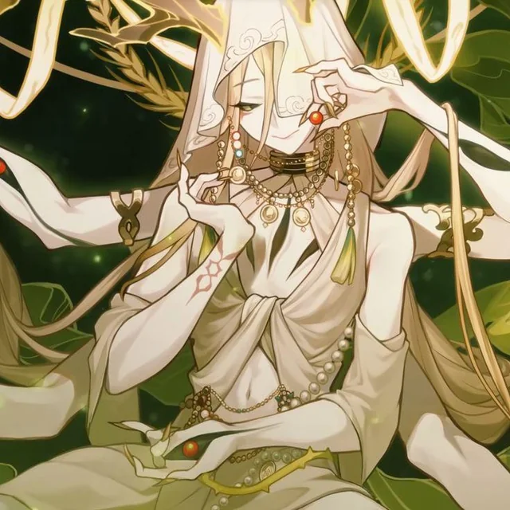

# Capítulo 10 — A Abundância

> **Aeon: Yaoshi**

Os seguidores do Caminho da Abundância acreditam que a vida é a maior dádiva do universo e que o propósito dela é preservar, restaurar e expandir toda forma de existência. Eles dominam forças capazes de curar feridas, fortalecer corpos e desafiar os limites naturais da mortalidade. Para os adeptos desse Caminho, nenhum ser deve ser perdido enquanto houver energia para sustentar a vida dele — e isso os torna protetores que mantêm os aliados de pé diante das maiores adversidades. Alguns seguidores, porém, levam a crença ao extremo e buscam uma existência eterna em que a própria vida se torna uma força impossível de controlar.

---

## 10.1 A ficha do Caminho

| | |
|---|---|
| **Aeon** | Yaoshi |
| **Eixo mecânico** | Cura, PV temporários e sustentação do grupo |
| **Recurso próprio** | Nenhum além dos acúmulos das Bênçãos: **Florescimento** (até 5) |
| **Atributo de Habilidade** | **Presença** ou **Sincronia** (escolha fixa na criação) |
| **Perícias com Eficiência** | **Liderança**, **Intuição**, **Sobrevivência** |
| **Índice de vitalidade N** | **5** |
| **PV** | 56 no nível 1 · 164 no 10 · **284** no 20 (com Bônus de Vigor +2) |
| **Bônus de Velocidade** | **+1** |

**Como a Abundância joga.** Você é o Caminho que decide quantos combates o grupo aguenta antes de precisar parar. O orçamento de desgaste do livro assume que o grupo termina cada combate com **73% a 81%** dos PV gastos e consegue encarar **três combates entre Descansos Longos** (capítulo 27) — e é a sua ficha que move esses dois números.

> **Cuidado com o turno parado.** Curar é a sua identidade, mas não é a sua obrigação em todos os turnos. Metade das Bênçãos deste capítulo é **passiva** ou dispara **quando você cura de qualquer jeito**, justamente para que você possa atacar sem sentir que abandonou o posto.

---

## 10.2 Cura, PV temporários e o teto que vale para todos

As três regras do capítulo 23 que governam este capítulo inteiro:

> **Cura acima do PV máximo é perdida.** A única exceção do livro é a Bênção **Excesso de Vida**, abaixo.
> **Teto global de PV temporários = `3 × Eficiência`**, vindos de **qualquer fonte**. PV temporários **não acumulam entre fontes: fica o maior valor.**
> **Cura de Bênção é valor fixo, dado ou múltiplo de nível** — nunca porcentagem do PV máximo do alvo.

**A régua de cura deste Caminho**, usada em três Bênçãos:

> **`5 × seu nível` PV, com teto de metade do PV máximo do alvo.**

| Seu nível | Cura | Teto contra um aliado da Destruição | Teto contra um aliado da Caça |
|---|---|---|---|
| 1 | 5 | 30 | 20 |
| 5 | 25 | 56 | 38 |
| 10 | 50 | 89 | 61 |
| 15 | 75 | 121 | 83 |
| 20 | **100** | 154 | 106 |

Para comparar com o que uma **Habilidade** de cura entrega (capítulo 16): Nível 1 cura `5d8`, média **22**; Nível 4 cura `7d20`, média **73**. A cura de Bênção é confiável e de graça; a de Habilidade é maior e custa PH. As duas existem de propósito.

> **O que mudou da v0.1, e por quê:** três Bênçãos deste Caminho curavam **"metade da vida máxima do alvo"**. No nível 20, isso é **154 de cura** num efeito gratuito, sem gastar PH — mais do que uma Habilidade de Nível 6, que custa 5 dos 7 PH do grupo. Pior: a cura por porcentagem **ignora o combate**. Ela cura o mesmo tanto contra um Comum e contra um Boss, e torna o PV um recurso que não existe. Com `5 × nível` e o teto de metade, a cura continua grande, continua decidindo combates, e continua tendo um número que o Mestre consegue orçar.

---

## 10.3 As 12 Bênçãos da Abundância

Seis sem requisito, quatro a partir do nível 9, duas a partir do nível 17. Você adquire **10** delas, uma em cada nível ímpar.

### 1. Fonte da Vida Eterna
**Tier I — sem requisito de nível**

> *"A energia vital flui através de você, e a sua presença vira uma bênção para quem está ao redor."*

**Efeito**

- Sempre que você cura um aliado, ele também ganha **PV temporários = 1 × Eficiência** (teto global `3 × Eficiência`, sem acumular entre fontes).
- Sempre que você cura alguém, **você** recupera **PV igual à sua Eficiência**.

### 2. Regeneração Celestial
**Tier I — sem requisito de nível**

> *"Seu corpo se regenera constantemente através da energia da Abundância."*

**Efeito**

- No início de cada um dos seus turnos, você recupera **`1d8`** PV (média **4**).
- Com **metade ou menos** dos seus PV, a recuperação sobe para **`2d8`** (média **9**).
- Você tem **Vantagem** em Testes de **Resistência Física** contra **veneno e doença**.

### 3. Bênção Revitalizante
**Tier I — sem requisito de nível**

> *"Sua energia pode restaurar até quem está à beira da morte."*

**Efeito** — gaste o seu **Ataque Básico** e escolha um aliado a até **Distância Média**:

- Ele recupera **`5 × seu nível`** PV, com teto de **metade do PV máximo dele**.
- Ele perde **1 condição** à sua escolha entre **Sangramento, Queimadura, Choque, Cisalhamento de Vento, Lentidão** e **Vulnerável** (capítulo 21).
- Ele ganha **RD igual à sua Eficiência** até o fim do próximo turno dele.
- Se ele estava em **Morrendo** (capítulo 23), ele **sai de Morrendo** e volta com os PV curados.

### 4. Vitalidade Compartilhada
**Tier I — sem requisito de nível**

> *"Sua vida está conectada a quem você protege."*

**Efeito** — **uma vez por turno**:

- Quando um aliado a até **Distância Curta** sofre dano, gaste a sua **Reação**: **metade do dano** (arredonda para baixo) passa para você, resolvido contra a **sua** RD.
- O aliado **recupera metade do que você recebeu** (arredonda para baixo, mínimo 1).

### 5. Florescimento da Alma
**Tier I — sem requisito de nível**

> *"Quanto mais você cura, mais forte a sua energia vital se torna."*

**Efeito**

- Sempre que você cura um aliado, ganhe **1 acúmulo de Florescimento**. Máximo de **5**; eles duram até o fim do combate.
- Cada acúmulo dá **+1** em Testes de Resistência e **+1 de Defesa**, respeitando o **teto de bônus somado** da sua faixa.
- Enquanto tiver **1 ou mais** acúmulos, você recupera **`1d4`** PV (média **2**) no início do seu turno.

### 6. Excesso de Vida
**Tier I — sem requisito de nível**

> *"Você acumula energia vital além do limite normal."*

**Efeito**

- **Toda cura que você receberia acima do seu PV máximo vira PV temporários** — dentro do **teto global de `3 × Eficiência`**, sem acumular com outra fonte. Esta é a **única exceção** do livro à regra de que cura excedente é perdida.
- Enquanto você tiver esses PV temporários:
  - **+2 RD** (dentro do teto de RD);
  - **+1 dado** nos seus efeitos de cura;
  - **+Eficiência** de dano nos seus ataques.

> **O que mudou da v0.1:** "+5 RD" virou **+2 RD**, que é a conversão oficial do livro. O motivo: com a Armadura Pesada (2 RD) e duas Bênçãos de +5, um personagem de nível 2 teria 12 de RD contra inimigos que causam 3 a 10 de dano — invulnerabilidade com outro nome, no segundo nível da campanha.

---

### 7. Corpo Imortal
**Tier II — requisito: nível 9**

> *"Seu corpo ultrapassou os limites naturais da sobrevivência."*

**Efeito**

- **+PV máximo igual a `2 × seu nível`**. No nível 9 são 18 PV; no 20, 40.
- Você tem **RD igual à sua Eficiência** (dentro do teto de RD).
- Quando cair a **um quarto ou menos** dos seus PV, ganhe **+2 RD** adicionais até o fim do próximo turno seu.

### 8. Raízes da Abundância
**Tier II — requisito: nível 9**

> *"Você espalha energia vital pelo campo de batalha."*

**Efeito** — gaste o seu **Ataque Básico** para criar uma zona de cura a até **Distância Média**, que dura **3 turnos** seus e abriga até **6 aliados**:

- Cada aliado na zona recupera **`1d6 + Eficiência`** PV no início do turno dele.
- Cada um rola com **Vantagem** os Testes de Resistência contra efeitos que **apliquem condições**.
- Cada um ganha **RD igual à sua Eficiência** (dentro do teto de RD).

### 9. Renascimento Natural
**Tier II — requisito: nível 9**

> *"A vida sempre encontra um caminho para continuar."*

**Efeito** — **uma vez por Descanso Longo**:

- Quando um aliado a até **Distância Média** cai a **0 PV**, ele fica com **1 PV** em vez de entrar em Morrendo.
- Ele recupera **`5 × seu nível`** PV (teto de metade do PV máximo dele) e ganha **+Eficiência de Defesa** até o fim do próximo turno dele.

### 10. Jardim de Yaoshi
**Tier II — requisito: nível 9** · *Bênção nova da v1.0*

> *"Onde você passa, as coisas insistem em crescer."*

**Efeito** — passiva:

- A **primeira cura que você faz em cada turno** alcança **1 aliado adicional** a até uma Distância do primeiro, com **metade do valor** (arredonda para baixo, mínimo 1).
- Aliado que você curou neste Ciclo **ignora Lentidão** até o fim do próximo turno dele.

---

### 11. Avatar da Abundância
**Tier III — requisito: nível 17**

> *"Você se torna uma manifestação viva da força da vida."*

**Efeito**

- **Todas as suas curas afetam 1 alvo adicional**, respeitando os limites de alvos do capítulo 16. Com *Jardim de Yaoshi*, a primeira cura do turno chega a **três** aliados.
- Aliado curado por você ganha, até o fim do próximo turno dele: **+1 de Defesa**, **RD igual à sua Eficiência** e **`1d6 + Eficiência`** PV no início daquele turno.
- **Uma vez por combate**, quando você ou um aliado cai a **0 PV**, a energia da Abundância rompe:
  - todos os aliados a até **Distância Longa** (até 6) recuperam **`5 × seu nível`** PV, com teto de metade do PV máximo de cada um;
  - **todas as condições** deles são removidas;
  - cada um ganha **+1** em toda rolagem até o fim do próximo turno dele.

> **O que mudou da v0.1:** "todos os aliados recuperam metade dos PV" e "aumento de Defesa (+3)" viraram, respectivamente, **`5 × nível` com teto de metade** e **+1 de Defesa**. O +3 de Defesa não foi cortado por ser grande: foi cortado porque o Avatar concede o bônus a **todo aliado curado**, e com quatro personagens isso colocaria o grupo inteiro em +3 permanente — o teto de bônus somado inteiro, gasto numa linha de uma Bênção.

### 12. Ciclo Interminável
**Tier III — requisito: nível 17** · *Bênção nova da v1.0*

> *"Yaoshi não devolve o que foi perdido. Yaoshi recusa a perda."*

**Efeito**

- **Passiva.** Quando a sua cura leva um aliado ao **PV máximo**, o excedente vira **PV temporários** para ele, dentro do teto global de `3 × Eficiência`. É a mesma exceção de *Excesso de Vida*, agora valendo para quem você cura.
- **Uma vez por Ciclo**, quando um aliado a até **Distância Longa** recebe uma **condição**, gaste a sua **Reação** para **removê-la na hora**, antes de ela produzir qualquer efeito.

---

## Resumo do capítulo

| # | Bênção | Tier | Em uma linha |
|---|---|---|---|
| 1 | **Fonte da Vida Eterna** | I | Cura também dá `1 × Eficiência` de PV temporários; você recupera `Eficiência` |
| 2 | **Regeneração Celestial** | I | `1d8` por turno, `2d8` abaixo da metade dos PV, Vantagem contra veneno |
| 3 | **Bênção Revitalizante** | I | `5 × nível` de cura, remove 1 condição, `RD = Eficiência`, tira de Morrendo |
| 4 | **Vitalidade Compartilhada** | I | Reação: absorve metade do dano do aliado e cura metade do absorvido |
| 5 | **Florescimento da Alma** | I | Acúmulos de Florescimento: +1 em Resistência e Defesa, até 5, e `1d4` por turno |
| 6 | **Excesso de Vida** | I | Cura excedente vira PV temporários; +2 RD, +1 dado de cura, `+Eficiência` de dano |
| 7 | **Corpo Imortal** | II (9+) | `+2 × nível` de PV máximo, `RD = Eficiência`, +2 RD quando muito ferido |
| 8 | **Raízes da Abundância** | II (9+) | Zona de 3 turnos: cura `1d6 + Eficiência`, Vantagem e `RD = Eficiência` |
| 9 | **Renascimento Natural** | II (9+) | Aliado a 0 PV fica com 1 PV e recupera `5 × nível` |
| 10 | **Jardim de Yaoshi** | II (9+) | A primeira cura do turno pega um segundo aliado pela metade |
| 11 | **Avatar da Abundância** | III (17+) | Toda cura pega +1 alvo; explosão de cura e limpeza quando alguém cai |
| 12 | **Ciclo Interminável** | III (17+) | Cura excedente vira PV temporários no aliado; Reação remove condição |
